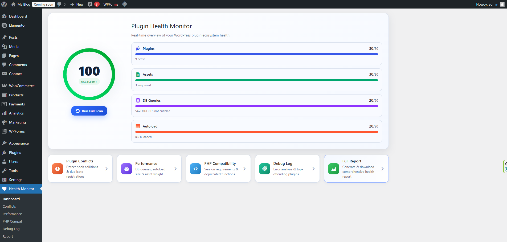
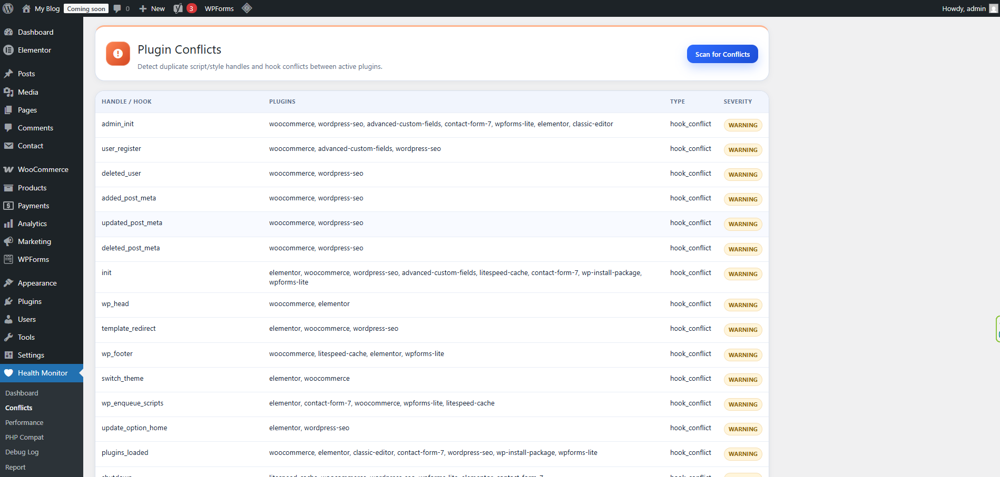
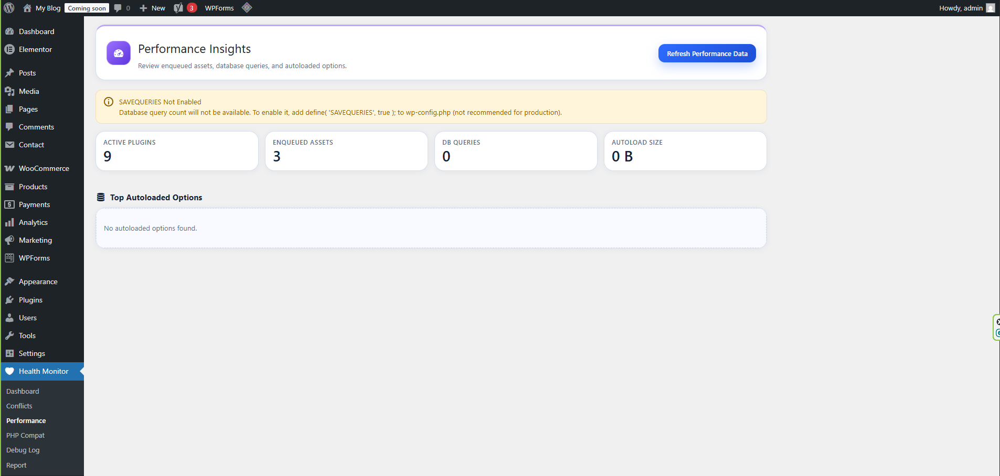
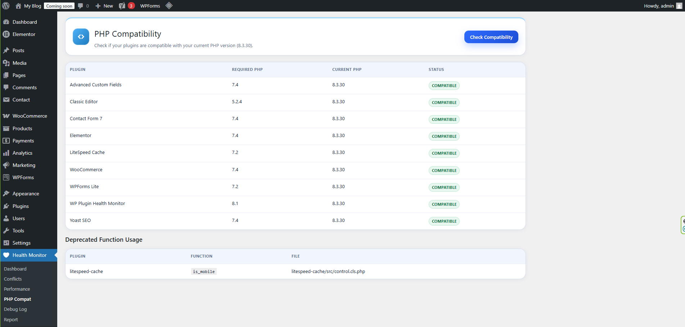
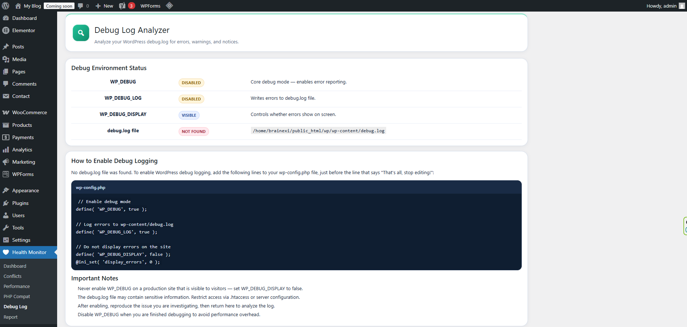
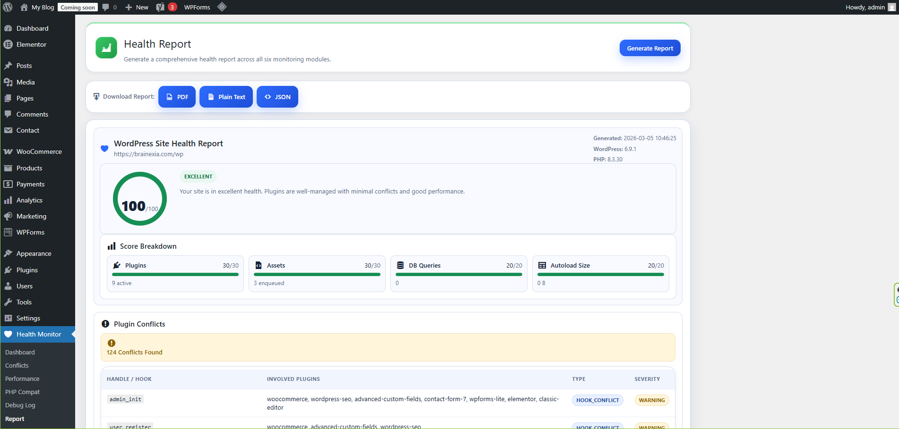

<div align="center">

<br>

# 🩺 Health Radar

<p align="center">
  <strong>Know what your plugins are really doing.</strong><br>
  Audit conflicts, performance, PHP compatibility, and debug errors — all from your WordPress admin dashboard.
</p>

<br>

[](https://wordpress.org/plugins/health-radar/)
[](https://php.net)
[](https://www.gnu.org/licenses/gpl-2.0.html)
[](https://wp-cli.org)
[](https://wordpress.org/plugins/plugin-check/)
[](https://github.com/fzihak/plugin-health-monitor/releases/tag/v1.0.0)

<br>

[📖 Documentation](https://fzihak.github.io/plugin-health-monitor/) &nbsp;·&nbsp; [🔌 WordPress.org](https://wordpress.org/plugins/health-radar/) &nbsp;·&nbsp; [🐛 Report a Bug](https://github.com/fzihak/plugin-health-monitor/issues) &nbsp;·&nbsp; [💡 Request a Feature](https://github.com/fzihak/plugin-health-monitor/issues)

<br>

</div>

---

## The Problem

When you install multiple WordPress plugins, things go wrong **silently**.

Scripts load twice. Hooks collide. Deprecated functions throw warnings. PHP version mismatches cause unexpected failures. Most site owners never notice — until something breaks in production.

> **Health Radar surfaces these problems before they reach your users.**

---

## Features

<br>

<table>
<thead>
<tr>
<th>Module</th>
<th>What It Does</th>
</tr>
</thead>
<tbody>
<tr>
<td><b>🔍 Conflict Detector</b></td>
<td>Scans enqueued scripts and styles for duplicate source files. Detects hook collisions where two or more plugins attach to the same WordPress action or filter.</td>
</tr>
<tr>
<td><b>⚡ Performance Panel</b></td>
<td>Counts enqueued JS/CSS files, estimates asset payload, measures DB query count via <code>SAVEQUERIES</code>, and audits <code>wp_options</code> autoload bloat. Outputs a 0–100 Health Score.</td>
</tr>
<tr>
<td><b>🐘 PHP Compatibility</b></td>
<td>Reads each plugin's <code>Requires PHP</code> header and compares it against the active server PHP version. Flags incompatible plugins and deprecated WordPress function usage.</td>
</tr>
<tr>
<td><b>📋 Debug Log Analyzer</b></td>
<td>Parses <code>wp-content/debug.log</code>, categorizes entries as Fatals, Warnings, or Notices, and attributes errors to the originating plugin via stack trace path matching.</td>
</tr>
<tr>
<td><b>🧬 Duplicate Asset Detector</b></td>
<td>Fingerprints local JS/CSS files via <code>md5_file()</code> to catch identical libraries loaded under different handles (jQuery, Lodash, Moment.js, Chart.js, and more).</td>
</tr>
<tr>
<td><b>📄 Report Generator</b></td>
<td>Aggregates all module output into a single printable page. Export to PDF via the browser's native print dialog, or pull JSON output via WP-CLI for automated pipelines.</td>
</tr>
</tbody>
</table>

<br>

---

## Screenshots

<table>
<tr>
<td align="center" width="50%">
<b>Dashboard</b><br>
<sub>Overall Health Score and module summary</sub><br><br>

</td>
<td align="center" width="50%">
<b>Conflicts</b><br>
<sub>Duplicate script handles and hook collisions</sub><br><br>

</td>
</tr>
<tr>
<td align="center">
<b>Performance</b><br>
<sub>Asset count, DB queries, autoload bloat, Health Score</sub><br><br>

</td>
<td align="center">
<b>PHP Compatibility</b><br>
<sub>Per-plugin PHP requirements vs. active server version</sub><br><br>

</td>
</tr>
<tr>
<td align="center">
<b>Debug Log</b><br>
<sub>Log entries grouped by plugin and error severity</sub><br><br>

</td>
<td align="center">
<b>Health Report</b><br>
<sub>Full report — export JSON/TXT or print to PDF</sub><br><br>

</td>
</tr>
</table>

---

## Requirements

| | Minimum |
|---|---|
| WordPress | 6.3 |
| PHP | 8.1 |

---

## Installation

<details>
<summary><b>From the WordPress Dashboard</b></summary>
<br>

1. Go to **Plugins → Add New Plugin**
2. Search for `Health Radar`
3. Click **Install Now**, then **Activate**

</details>

<details>
<summary><b>Manual Upload</b></summary>
<br>

1. Download the latest release from the [Releases](https://github.com/fzihak/plugin-health-monitor/releases) page
2. Upload the `health-radar` folder to `/wp-content/plugins/`
3. Activate from the **Plugins** screen in WordPress

</details>

<details>
<summary><b>Via WP-CLI</b></summary>
<br>

```bash
wp plugin install health-radar --activate
```

</details>

---

## Admin Pages

After activation, a **Health Radar** menu appears in your WordPress sidebar.

| Page | Description |
|---|---|
| **Dashboard** | Overall Health Score and a summary of all modules |
| **Conflicts** | Duplicate script handles and hook collisions |
| **Performance** | Asset count, payload size, DB query count, autoload size |
| **PHP Compatibility** | Per-plugin PHP requirements vs. current server PHP |
| **Debug Log** | Parsed log entries grouped by plugin and severity |
| **Generate Report** | Full single-page report, exportable to PDF |

---

## WP-CLI

```bash
# Run a full health scan
wp healthmonitor scan

# Show Health Score only
wp healthmonitor score

# List all detected conflicts
wp healthmonitor conflicts

# Generate a full report
wp healthmonitor report

# Generate report as JSON (for pipelines/automation)
wp healthmonitor report --format=json

# View recent debug log entries
wp healthmonitor log --last=50
```

---

## How the Health Score Works

The score is a weighted aggregate across **five dimensions**, totaling 100 points.

| Dimension | Weight | Description |
|---|---|---|
| Conflict score | 20 pts | Hook collisions and duplicate script/style handles |
| Performance score | 25 pts | Asset count, estimated payload, DB queries, autoload size |
| PHP compatibility score | 20 pts | Incompatible plugins and deprecated function usage |
| Debug log score | 20 pts | Error frequency and severity in `debug.log` |
| Asset health score | 15 pts | Duplicate fingerprinted JS/CSS files |

A score of **80+** is considered healthy. Below **50** indicates significant issues requiring attention.

---

## Security

> This plugin was built with security-first principles throughout.

- All file reads use `WP_Filesystem` — no direct `fopen`/`fread` calls
- All AJAX handlers verify nonces via `check_ajax_referer()`
- All admin pages enforce `manage_options` capability check
- All output escaped with `esc_html()`, `esc_attr()`, and `esc_url()`
- All database queries use `$wpdb->prepare()`
- Autoload query result cached with `wp_cache_get/set` to avoid redundant DB hits
- Zero external HTTP requests — ever

---

## Privacy

This plugin does not collect, transmit, or store **any** data outside of the WordPress site it is installed on.

No telemetry. No usage tracking. No external API calls. No phoning home.

---

## Contributing

Contributions are welcome. Please **open an issue before submitting a PR** to discuss the change first.

```bash
git checkout -b feature/your-feature-name
git commit -m "Add: brief description"
git push origin feature/your-feature-name
```

All PHP must follow [WordPress Coding Standards](https://developer.wordpress.org/coding-standards/wordpress-coding-standards/).

---

## Changelog

### [1.0.0] — 2026-03-18 (Review Update)

**WordPress.org review fixes (same release version).**

- Removed inline JavaScript redirect from the admin documentation page and replaced it with a standard admin link/button.
- Removed direct loading of `wp-admin/includes/plugin.php`.
- Refactored path/directory resolution to use WordPress helper-based locations instead of hardcoded internal constants.
- Updated debug log path handling to use centralized resolver methods.

### [1.0.0] — 2026-03-05

**Initial public release.**

- 🔍 Plugin Conflict Detector — hook collisions + duplicate script/style handles
- ⚡ Performance Insight Panel — DB queries, asset count, autoload size, 0–100 Health Score
- 🐘 PHP Compatibility Checker — per-plugin PHP validation + deprecated function scan
- 📋 Debug Log Analyzer — fatal/warning/notice grouping by top-offending plugin
- 🧬 Duplicate Asset Detector — md5 fingerprinting across JS/CSS handles
- 📄 Health Report Generator — JSON/TXT download + print-to-PDF
- 🖥️ Full WP-CLI command suite (`scan`, `score`, `conflicts`, `report`, `log`)
- Custom radar SVG admin menu icon
- Automated Plugin Check scan: ✅ PASS

---

## License

Licensed under the [GNU General Public License v2.0](https://www.gnu.org/licenses/gpl-2.0.html) or later.

---

<div align="center">

<br>

Made with ❤️ by **[Foysal Zihak](https://github.com/fzihak)**

[](https://github.com/fzihak)
[](https://linkedin.com/in/zihak)

<br>

</div>
